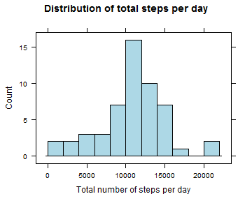
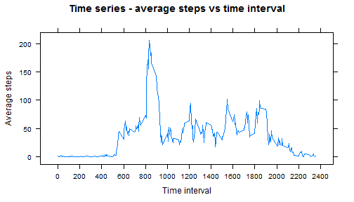
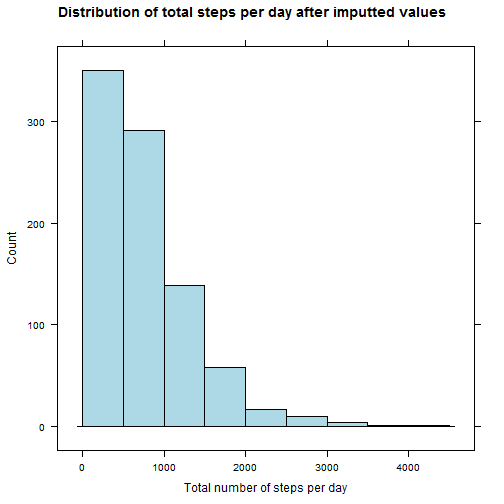
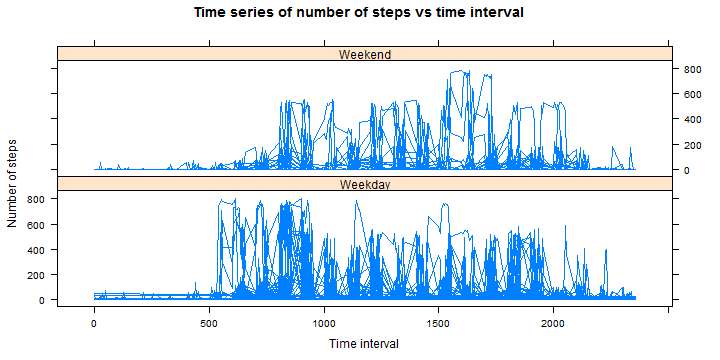

# The goal
**The ultimate goal of This assignment is to make use of data from a personal activity monitoring device. This device collects data at 5 minute intervals through out the day. The data consists of two months of data from an anonymous individual collected during the months of October and November, 2012 and include the number of steps taken in 5 minute intervals each day.**

**1- Data collection and management**

The data for this assignment can be downloaded from the course web site **https://d396qusza40orc.cloudfront.net/repdata%2Fdata%2Factivity.zip** and The variables included in this dataset are:

    steps: Number of steps taking in a 5-minute interval (missing values are coded as NA)
    date: The date on which the measurement was taken in YYYY-MM-DD format
    interval: Identifier for the 5-minute interval in which measurement was taken


**1-1 Loading and preprocessing the data and  setting the time in English**
  
My system date is  in french, I have to set the  date in english because of errors. 
For downloading and reading data we use URL to get data from,unzipped them and store it in
the new data frame called data_activity.


```r
Sys.setlocale("LC_TIME", "English")
```

```
## [1] "English_United States.1252"
```

```r
if (!file.exists("data")) {dir.create("data")}
Url1 <- "http://d396qusza40orc.cloudfront.net/repdata%2Fdata%2Factivity.zip"
destination <- "./data/activity.zip"
download.file(Url1, destfile = destination)
dateDownloaded <- date()
data_activity <- read.csv(unz("./data/activity.zip", "activity.csv"))
```


After loaded the data into R, we use the commands: class(), summary(),head(),dim() to examine the class, the distribution of the data_activity data,and how many rows
and columns are in the data.


```r
class(data_activity)
```

```
## [1] "data.frame"
```

```r
head(summary(data_activity))
```

```
##      steps                  date            interval       
##  "Min.   :  0.00  " "2012-10-01:  288  " "Min.   :   0.0  "
##  "1st Qu.:  0.00  " "2012-10-02:  288  " "1st Qu.: 588.8  "
##  "Median :  0.00  " "2012-10-03:  288  " "Median :1177.5  "
##  "Mean   : 37.38  " "2012-10-04:  288  " "Mean   :1177.5  "
##  "3rd Qu.: 12.00  " "2012-10-05:  288  " "3rd Qu.:1766.2  "
##  "Max.   :806.00  " "2012-10-06:  288  " "Max.   :2355.0  "
```

```r
dim(data_activity)
```

```
## [1] 17568     3
```


**2-The mean of total number of steps taken per day**

We assign steps,date,interval variables to culumn of data frame


```r
steps <-data_activity$steps
head(steps)
```

```
## [1] NA NA NA NA NA NA
```

```r
date <- data_activity$date
head(date)
```

```
## [1] 2012-10-01 2012-10-01 2012-10-01 2012-10-01 2012-10-01 2012-10-01
## 61 Levels: 2012-10-01 2012-10-02 2012-10-03 2012-10-04 ... 2012-11-30
```

```r
interval <- data_activity$interval
head(interval)
```

```
## [1]  0  5 10 15 20 25
```

we have to  ignore the missing values in the dataset in this step.


```r
steps_NA_Remove <- steps[!is.na(steps)]
date_NA_remove <- date[!is.na(steps)]
factorDate <- factor(date_NA_remove)
```

*2_1 Calculate the total number of steps taken per day*

we use lattice,caTools packages and in particular lattce to demonstrate the visualizations and graphics
What is mean total number of steps taken per day


```r
library(lattice)
library(caTools)
```

 The total number of steps for each day


```r
steps_Use <- tapply(steps_NA_Remove, factorDate, sum)
head(steps_Use)
```

```
## 2012-10-02 2012-10-03 2012-10-04 2012-10-05 2012-10-06 2012-10-07 
##        126      11352      12116      13294      15420      11015
```

*2_2 Make a histogram of the total number of steps taken each day*


```r
histogram(steps_Use,breaks = 10,xlab = "Total number of steps per day",
main = "Distribution of total steps per day", col = "lightblue",type = "count")
```

 

*2_3 Calculate and report the mean and median called mean_steps_Use, and median_steps_Use   of the total number of steps taken per day*


```r
mean_steps_Use <- mean(steps_Use)
mean_steps_Use
```

```
## [1] 10766.19
```

```r
median_steps_Use <- median(steps_Use)
median_steps_Use 
```

```
## [1] 10765
```


**3- The average daily activity pattern**

*3_1 assign interval as factor and calculate the average of steps for each 5 minute period* 


```r
steps <-data_activity$steps
interval_factor <- factor(interval)[1:nlevels(factor(interval))]
average_steps <- tapply(steps, factor(interval), mean, na.rm = TRUE)
average_steps <- sapply(average_steps, simplify = array, round, 2)
scales=list( x=list(at = seq(0, 2400, 200))) 
```

*3_2 Time series plot of the 5-minute interval (x-axis) and the average number of steps taken, averaged across all days (y-axis)*
 
plotting the time series


```r
xyplot(ts(average_steps) ~ interval[1:288],
type = "l",xlab = "Time interval",ylab = "Average steps",main = "Time series - average steps vs time interval",scales = scales)
```

 

*3_3 The maximum number called time_max, of steps in the 5-minute interval, on average across all the days in the dataset*


```r
tab_interv <- data.frame(interval_factor, average_steps)
tab_interv <- tab_interv[order(tab_interv$average_steps, 
decreasing = TRUE),]
time_max <- tab_interv$interval_factor[1]
time_max <- as.numeric(as.character(time_max))
time_max
```

```
## [1] 835
```

**4- Imputing missing values**

*4_1 Checking locations of missing data by Using summary statistics to spot problems*


```r
summary(steps)
```

```
##    Min. 1st Qu.  Median    Mean 3rd Qu.    Max.    NA's 
##    0.00    0.00    0.00   37.38   12.00  806.00    2304
```

```r
length(steps[is.na(steps)])
```

```
## [1] 2304
```

*Create a new dataset called steps.New that is equal to the original dataset but with the missing data filled in*


```r
steps.New<-data_activity$steps
for (i in which(sapply(steps.New, is.na))) {

if (i <= 288){
steps.New[i] <- average_steps[i]
}

else{
j <- i%%288 + 1
steps.New[i] <- average_steps[j]
}
}
head(steps.New)
```

```
## [1] 1.72 0.34 0.13 0.15 0.08 2.09
```


*4_2 Make a histogram of the total number of steps taken each day*

We have to create  a factor vector called days_factor.New,for all of the days and
Create a new  dataset called total_steps.New that is equal to the original dataset but with the missing data filled in


```r
days_factor.New <- factor(steps.New)
total_steps.New <- tapply(steps.New, days_factor.New, sum)
head(total_steps.New)
```

```
##    0 0.08 0.11 0.13 0.15 0.17 
## 0.00 1.28 0.88 3.12 2.40 2.72
```


histogram of the total number of steps taken each day


```r
histogram(total_steps.New , breaks = 10,xlab = "Total number of steps per day", 
main = "Distribution of total steps per day after imputted values", col = "lightblue",
type = "count")
```

 

*4_3 Calculate and report the mean and median total number of steps taken per day we called the output called Resume*


```r
mean.New <- mean(total_steps.New)
median.New <- median(total_steps.New)
initial <- c(mean_steps_Use, median_steps_Use)
final<- c(mean.New, median.New)
Resume <- data.frame(initial,final)
rownames(Resume)<-c("mean", "median")
Resume
```

```
##         initial    final
## mean   10766.19 755.7388
## median 10765.00 612.0000
```

**5- Are there differences in activity patterns between weekdays and weekends**

*5_1 Create a new factor variable in the dataset with two levels - "weekday" and "weekend" indicating whether a given date is a weekday or weekend day*


```r
date <- data_activity$date
head(date)
```

```
## [1] 2012-10-01 2012-10-01 2012-10-01 2012-10-01 2012-10-01 2012-10-01
## 61 Levels: 2012-10-01 2012-10-02 2012-10-03 2012-10-04 ... 2012-11-30
```

```r
date.New <- as.Date(date)
whichDay <- weekdays(date.New)
weekendDays <- c("Saturday", "Sunday")
dataframe_date <- data.frame(date.New, interval_factor, steps.New, whichDay)
dataframe_date$dayType = ifelse(dataframe_date$whichDay %in% c("Monday","Tuesday","Wednesday","Thursday","Friday"),"Weekday","Weekend")
head(dataframe_date)
```

```
##     date.New interval_factor steps.New whichDay dayType
## 1 2012-10-01               0      1.72   Monday Weekday
## 2 2012-10-01               5      0.34   Monday Weekday
## 3 2012-10-01              10      0.13   Monday Weekday
## 4 2012-10-01              15      0.15   Monday Weekday
## 5 2012-10-01              20      0.08   Monday Weekday
## 6 2012-10-01              25      2.09   Monday Weekday
```


*5_2 Make a panel plot containing a time series plot*


```r
xyplot(dataframe_date$steps.New ~ interval | dataframe_date$dayType,layout=c(2,1), type = "l", xlab = "Time interval", ylab = "Number of steps", 
main = "Time series of number of steps vs time interval" )
```

 


